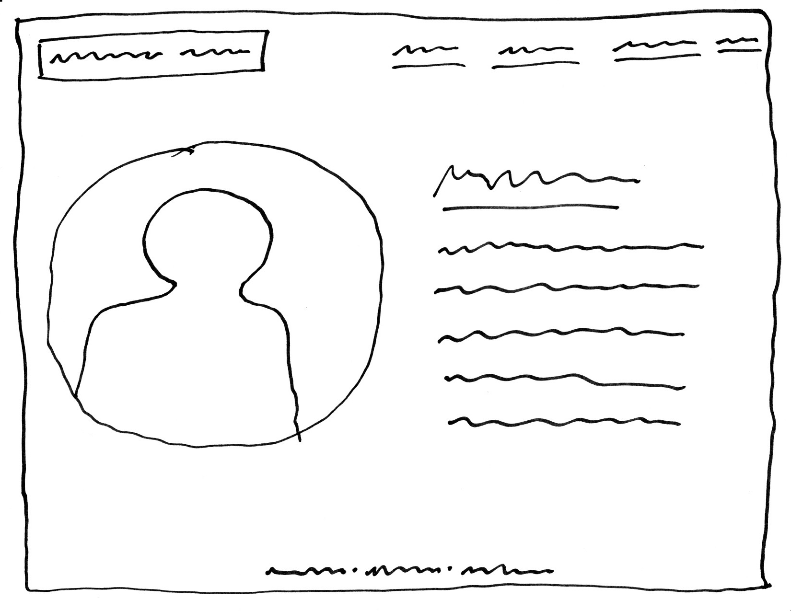

# Project 1, Milestone 1 - Design & Plan

Your Name: Constantin Miranda

## Markdown

## 1. Persona

[1. Pick a persona]

I've selected **Tim** as my persona.

I selected Tim as my persona because he likes learning all the available functionality on all of his devices, meaning that whatever feature I build into my site will be used. Additionally, if Tim can't fix a problem, he blames it on the software vendor. He believes it is not his fault if he can't get it to work. Most would view this as a downside, but I view it as a motivating factor to make my site as simple to use as possible.

## 2. Sketches

[2. Create some sketches to generate ideas about a website design that would work for your persona.]

[Tell us why your sketches meet the needs of your persona. 1-3 sentences]

My focus on my portfolio site is simplicity and clean lines. This aligns directly with Tim's belief that it is not his fault if he can't get a feature to work, and thus I am motivated to create a site that is extremely user friendly.

[Insert your 2-3 sketches here.]

## 3. Wireframes

[3. Author detailed wireframes that will become the design that you program for the final milestone.]

[Insert your 3-4 wireframes here.]

## 4. Coding Plan & Pseudocode

[4. Author a plan for how you will code your PHP website.]

[Make sure you layout how to you plan to use PHP *includes*.]

Similarly to our first lab, all of my pages will have 3 common elements: the header, footer, and and initialization. Therefore, I plan on making 3 php files for my PHP *includes*: header.php, footer.php, and init.php. Header.php will handle the menu bar and the function that changes the CSS for the current page menu item. Footer.php will handle the footer, which will include links to my main social media accounts (LinkedIn, GitHub, Instagram). Init.php will help header.php determine the current page and change the menu bar style.

[Write your pseudocode for your user defined function.]

My user defined function will animate the home page text so I do not have to "copy and paste" code. Specifically, I want to do something with the "This is me." title which will either animate an underline or animate a "typing out" visual.

function animateTitle ($startIndex, $endIndex) {
  foreach (character in sentence) {
    iterate through and underline each character so it looks like it is being underlined or typed out.
  }
}

CHANGES: Ultimately, I ended up using a user defined function to render the stylistic html portion of my passions page. 
